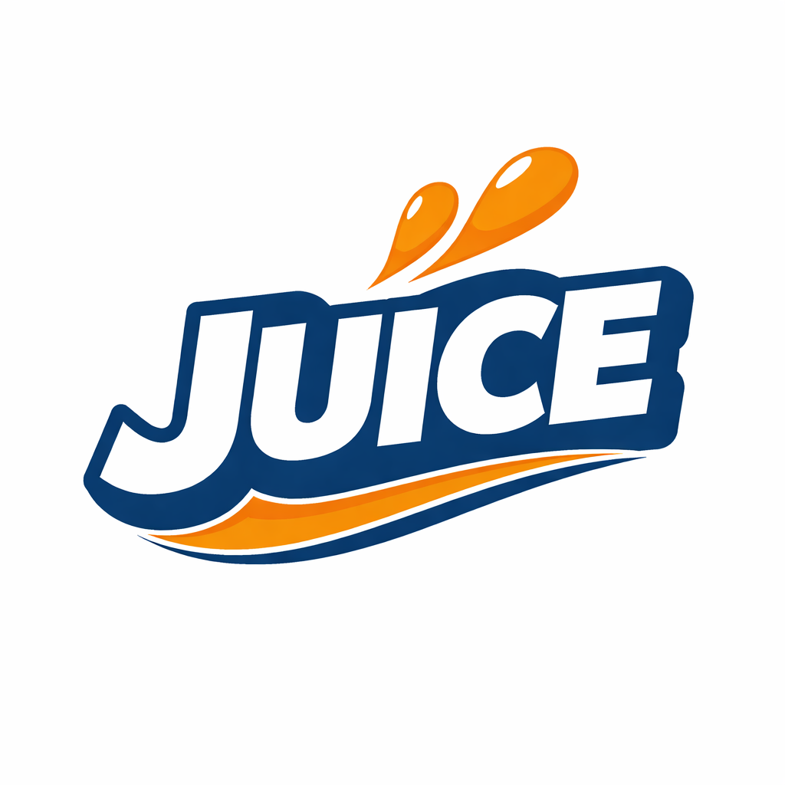

<p align="center">
  
</p>

# Juice

A JavaScript-to-Erlang compiler that lets you write JS and run it on the BEAM.
Built for JS developers who want to experience processes, message passing, GenServers, and OTP supervision without learning Erlang syntax.

## Install

Prerequisites: [Rust](https://rustup.rs/) and [Erlang/OTP](https://www.erlang.org/downloads)

```
git clone https://github.com/choiway/juice.git
cd juice
cargo build --release
```

The binary is at `target/release/juice`. Optionally, `cargo install --path .` to put it on your PATH.

## Hello World

```js
// hello.ts
console.log("hello, world")
```

```
$ juice hello.ts --run
hello, world
```
